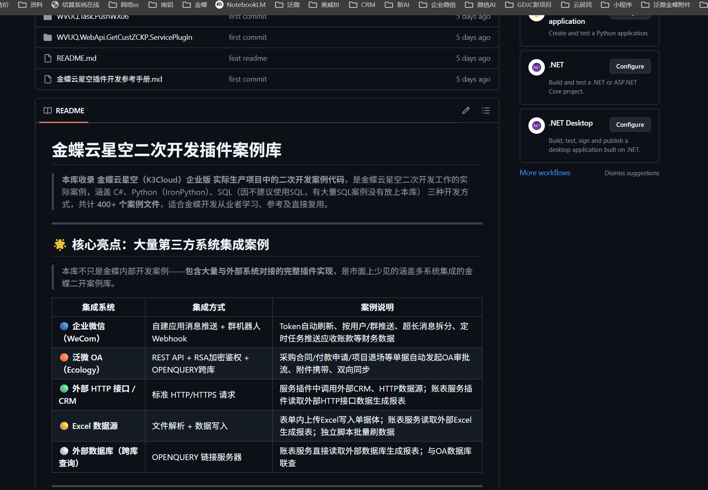

# 👨‍💻 项目合集（Project Portfolio）

> 🚀 专注企业级系统开发｜ERP二开｜数据平台｜系统集成

---

## 📸 项目展示

---

## 🚀 项目概览

本仓库用于整理本人在企业开发中的核心项目，涵盖：

- ERP（二次开发 / 金蝶云星空）
- 数据平台 / 轻应用平台
- 管理系统（业务系统）
- 系统集成（企业微信 / OA / 外部接口）
- IoT / CRM 等扩展方向

---

# 🌐 一、公开项目（Open Source Projects）

## ⭐ 1. XingEngine（星擎）— 金蝶数据发布平台

🔗 https://github.com/nljqrdou-code/xingengine

### 📌 项目简介
面向金蝶云星空的数据访问与轻应用平台，通过配置驱动实现数据发布与访问。

### 💡 核心能力
- 配置驱动（SQL / 存储过程 / API）
- 审批发布机制（类似“上线流程”）
- 数据源双模式（数据库 / API）
- 报表 / 图表 / 表单动态配置
- 支持 PC + 移动端访问

### 🎯 价值
👉 无需登录金蝶系统  
👉 浏览器直接访问实时数据  
👉 将 ERP 数据能力“轻应用化”

---

## ⭐ 2. 水店管理系统（Water Store Management System）

🔗 https://github.com/nljqrdou-code/waterstoremanagementsystem

### 📌 项目简介
面向桶装水门店 / 配送水站的业务管理系统，覆盖完整业务闭环。

### 💡 核心模块
- 客户管理
- 配送管理
- 桶管理（押金 / 流转）
- 库存管理
- 财务统计

### 🎯 价值
👉 替代传统手工记账  
👉 提升配送效率  
👉 实现数据化经营  

---

# 🔒 二、私有项目（Private Projects）

> 以下项目基于实际企业项目开发，暂不开放源码，仅作能力说明

---

## 🟡 1. 金蝶云星空二次开发案例库

### 📌 项目简介
基于金蝶云星空企业版实际生产项目整理的插件案例库，涵盖：

- Python（IronPython）
- C#
- SQL（部分）

👉 共计 **400+ 实战案例**

---

### 🌟 核心亮点（系统集成能力）

| 集成系统 | 技术方案 | 说明 |
|----------|--------|------|
| 企业微信（WeCom） | API + Webhook | 消息推送 / 定时任务 / Token管理 |
| 泛微 OA（Ecology） | REST + RSA加密 | 审批流集成 / 附件 / 双向同步 |
| 外部 HTTP / CRM | HTTP接口调用 | 外部系统对接 |
| Excel | 文件解析 | 批量数据导入 |
| 外部数据库 | OPENQUERY | 跨库查询 |

---

### 📊 能力总结
- 各类插件（表单 / 列表 / 服务 / 转换 / 账表）
- 企业级系统集成经验
- ERP → OA / 企业微信完整方案

---

## 🟢 2. IoT 工业设备平台

### 📌 项目简介
基于工业现场 PLC 设备的数据采集与监控平台。

### 💡 功能说明
- PLC设备数据采集
- 实时数据展示（图表）
- 状态监控
- 安全控制（权限 / 指令控制）

👉 适用于工业自动化 / 设备监控场景  

---

## 🔵 3. CRM 客户管理平台

### 📌 项目简介
基于开源 CRM 系统深度定制开发的企业客户管理平台。

### 💡 功能说明
- 客户管理
- 销售流程管理
- 数据统计分析
- 权限与角色控制

👉 适用于销售型企业  

---

# 🧠 技术栈（Tech Stack）

- 后端：Java / Spring Boot / Python / C#
- 前端：Vue / ElementUI
- 数据库：MySQL / SQL Server
- 架构：微服务 / 配置驱动 / 插件机制
- ERP：金蝶云星空（K3Cloud）

---

# 📈 技术方向

当前主要专注于：

- 企业信息化系统开发
- ERP 二次开发（深度）
- 数据平台 / 数据发布
- 系统集成（OA / 企业微信 / CRM）
- 轻应用平台（低代码 / 配置化）

---

# 📞 联系方式

如有以下需求，欢迎交流：

- 金蝶云星空二开
- 数据平台建设
- 系统集成（OA / 企业微信）
- 企业管理系统开发

👉 （微信/邮箱 1705077@qq.com）

---

# ⭐ 支持一下

如果这些项目对你有帮助，欢迎点个 Star ⭐